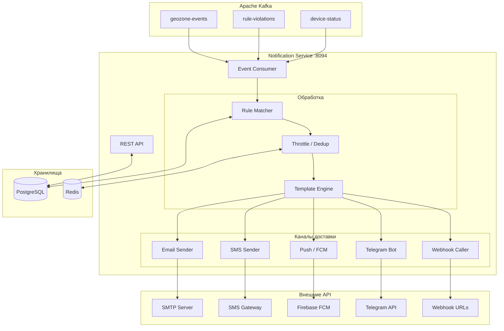
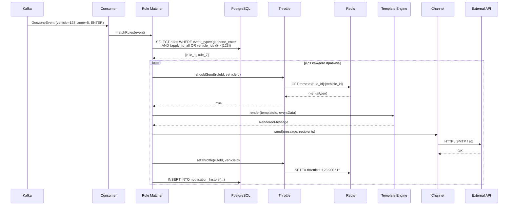

# Notification Service — Архитектура

> Тег: `АКТУАЛЬНО` | Обновлён: `2026-03-01` | Версия: `1.0`

## Общая схема



## Sequence диаграмма



## Компоненты

| Компонент | Ответственность |
|-----------|----------------|
| **EventConsumer** | Kafka consumer (multi-topic), десериализация |
| **RuleMatcher** | Поиск правил в PostgreSQL, фильтрация по vehicle/group |
| **ThrottleService** | Rate limiting + дедупликация через Redis |
| **TemplateEngine** | Рендеринг шаблонов с подстановкой переменных |
| **EmailChannel** | Отправка email через SMTP |
| **SmsChannel** | Отправка SMS через SMS.ru / Twilio |
| **PushChannel** | Push через Firebase Cloud Messaging |
| **TelegramChannel** | Сообщения через Telegram Bot API |
| **WebhookChannel** | POST на URL с retry + exponential backoff |
| **NotificationService** | Оркестратор: matcher → throttle → template → channels |
| **REST API** | CRUD правил, шаблонов, история, тест отправки |

## ZIO Layer граф

```
AppConfig.allLayers
  ├── TransactorLayer.live (PostgreSQL)
  ├── RuleRepository.live
  ├── TemplateRepository.live
  ├── HistoryRepository.live
  ├── ThrottleService.live (Redis)
  ├── TemplateEngine.live
  ├── EmailChannel.live
  ├── SmsChannel.live
  ├── PushChannel.live
  ├── TelegramChannel.live
  ├── WebhookChannel.live
  ├── DeliveryService.live (все каналы)
  ├── RuleMatcher.live
  ├── NotificationService.live
  ├── EventConsumer.live
  └── Server.live (zio-http)
```
