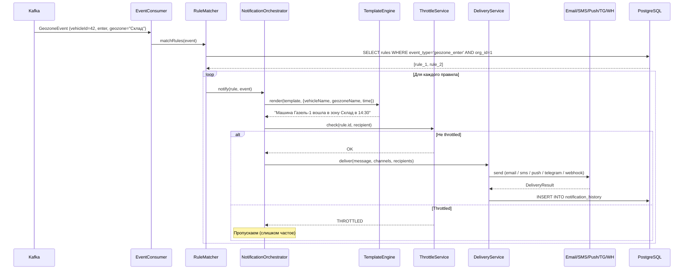

> Тег: `АКТУАЛЬНО` | Обновлён: `2026-03-02` | Версия: `1.0`

# 📖 Изучение Notification Service

> Руководство по Notification Service — сервису доставки уведомлений по 5 каналам.

---

## 1. Назначение

**Notification Service (NS)** — обрабатывает события из Kafka и доставляет уведомления:
- **5 каналов:** Email (SMTP), SMS (провайдер), Push (FCM), Telegram (bot API), Webhook
- Правила: какие события → каким пользователям → по каким каналам
- Шаблоны: Mustache-подобные шаблоны с переменными
- Throttling: ограничение частоты (не больше N уведомлений в минуту)
- История: хранение всех отправленных уведомлений

**Порт:** 8094

---

## 2. Архитектура

```
Kafka (geozone-events, rule-violations, device-status)
    → EventConsumer → RuleMatcher → NotificationOrchestrator
                                       ├── TemplateEngine (рендеринг)
                                       └── DeliveryService
                                           ├── EmailChannel (SMTP)
                                           ├── SmsChannel (HTTP API)
                                           ├── PushChannel (FCM)
                                           ├── TelegramChannel (Bot API)
                                           └── WebhookChannel (HTTP POST)
                                                     ↓
                                       ThrottleService (rate limiting, Ref)
                                       HistoryRepository (PostgreSQL)
```

### Компоненты

| Файл | Назначение |
|------|-----------|
| `kafka/EventConsumer.scala` | Consume из 3 Kafka топиков |
| `service/RuleMatcher.scala` | Сопоставление события с правилами уведомлений |
| `service/NotificationOrchestrator.scala` | Оркестрация: правила → шаблон → каналы |
| `service/TemplateEngine.scala` | Рендеринг шаблонов с подстановкой переменных |
| `channel/DeliveryService.scala` | Роутинг по каналам, retry, throttle |
| `channel/EmailChannel.scala` | javax.mail SMTP отправка |
| `channel/SmsChannel.scala` | HTTP API провайдера SMS |
| `channel/PushChannel.scala` | Firebase Cloud Messaging |
| `channel/TelegramChannel.scala` | Telegram Bot API |
| `channel/WebhookChannel.scala` | HTTP POST на указанный URL |
| `storage/ThrottleService.scala` | Rate limiting через ZIO Ref |
| `repository/RuleRepository.scala` | CRUD правил уведомлений |
| `repository/TemplateRepository.scala` | CRUD шаблонов |
| `repository/HistoryRepository.scala` | История уведомлений |

---

## 3. Domain модель

```scala
// Правило уведомления
case class NotificationRule(
  id: RuleId,
  organizationId: OrganizationId,
  name: String,
  eventType: EventType,           // GeozoneEnter, GeozoneLeave, SpeedViolation, DeviceOffline, ...
  conditions: RuleConditions,      // Фильтр: vehicleIds, geozoneIds, minSpeed, ...
  channels: Set[Channel],          // email, sms, push, telegram, webhook
  recipients: Recipients,          // userIds, emails, phones, telegramChatIds, webhookUrls
  templateId: TemplateId,
  schedule: Option[Schedule],      // Когда активно (рабочие часы, выходные)
  throttle: Option[ThrottleConfig], // Не чаще чем раз в N минут
  isActive: Boolean
)

// Шаблон
case class NotificationTemplate(
  id: TemplateId,
  organizationId: OrganizationId,
  name: String,
  subject: Option[String],         // Тема (для email)
  body: String,                    // Тело с переменными: {{vehicleName}}, {{speed}}, {{geozoneName}}
  channel: Channel
)

// Каналы доставки
enum Channel:
  case Email, Sms, Push, Telegram, Webhook

// Результат доставки
case class DeliveryResult(
  channel: Channel,
  status: DeliveryStatus,          // Sent, Failed, Throttled
  recipient: String,
  error: Option[String],
  sentAt: Instant
)
```

---

## 4. Потоки данных



---

## 5. Kafka топики

| Направление | Топик | Содержимое |
|-------------|-------|------------|
| Consume | `geozone-events` | Вход/выход из геозон (от Rule Checker) |
| Consume | `rule-violations` | Превышение скорости (от Rule Checker) |
| Consume | `device-status` | Устройство онлайн/оффлайн (от CM) |

---

## 6. API endpoints

```bash
# Правила уведомлений
POST   /notification-rules        # Создать правило
GET    /notification-rules        # Список правил организации
GET    /notification-rules/{id}   
PUT    /notification-rules/{id}   
DELETE /notification-rules/{id}   
POST   /notification-rules/{id}/test  # Тестовая отправка

# Шаблоны
POST   /templates
GET    /templates
PUT    /templates/{id}
DELETE /templates/{id}

# История
GET    /history?from=...&to=...&vehicleId=...
GET    /history/stats              # Статистика доставки

# Health
GET    /health
```

---

## 7. ThrottleService (Ref)

```scala
// Текущая реализация — in-memory (допустимо для MVP)
case class ThrottleService(
  throttleRef: Ref[Map[String, Instant]],  // lastSentTime по ключу
  rateRef: Ref[Map[String, Int]]           // счётчик за период
)

// Ключ throttle: "{ruleId}:{recipient}"
// При рестарте — потеря throttle state (может отправить дубль)
// Это ДОПУСТИМО: лучше отправить лишнее уведомление чем потерять критичное
```

---

## 8. Типичные ошибки

| Проблема | Причина | Решение |
|----------|---------|---------|
| Email не отправляется | Неправильный SMTP / credentials | Проверить конфиг, telnet smtp-server 587 |
| Telegram timeout | Бот не создан / chat_id неверный | Проверить BotFather, getUpdates |
| Дубли уведомлений после рестарта | ThrottleService в Ref | Допустимо для MVP, перевести на Redis в Phase 2 |
| Consumer lag | Медленная отправка (SMTP timeout) | Увеличить concurrency, async отправка |

---

## 9. Связи

- **Rule Checker** → `geozone-events`, `rule-violations`
- **Connection Manager** → `device-status`
- **Web Frontend** → управление правилами и шаблонами через REST API

---

*Версия: 1.0 | Обновлён: 2 марта 2026*
